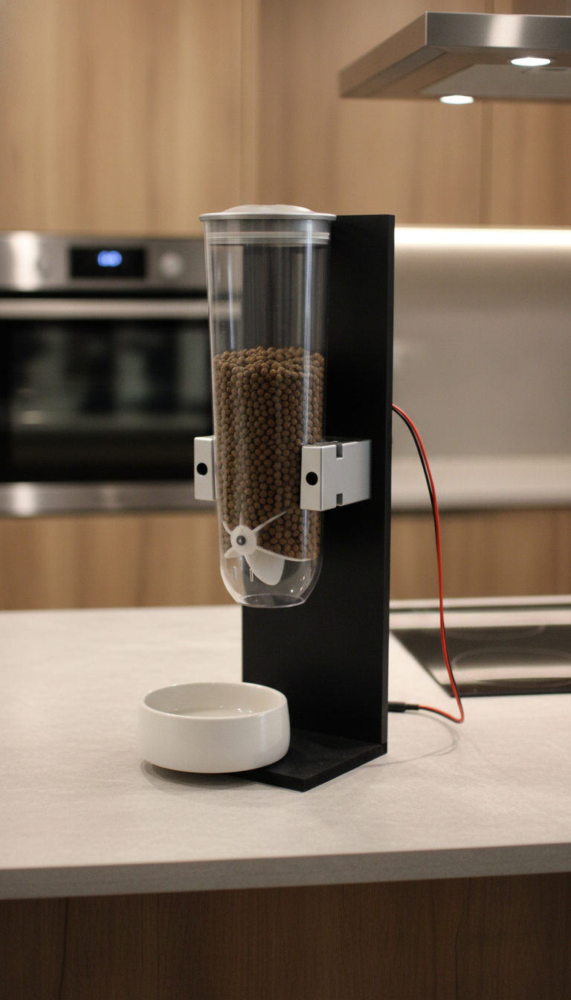
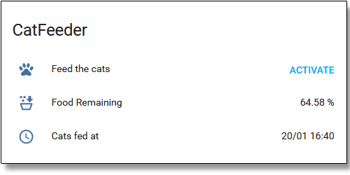

# 🐱 MQTT CatFeeder


**CatFeeder** is an Arduino (ESP8266) MQTT-controlled cat feeder designed to feed your pets remotely or on a schedule.
This project is a fork of [jorgerance/catFeeder](https://github.com/jorgerance/catFeeder), replacing the original Telegram bot with **MQTT** and **Home Assistant** integration.

**New Features in this fork:**
*   **MQTT Support:** Fully controlled via MQTT topics.
*   **Home Assistant:** Ready-to-use integration (sensors + scripts).
*   **Manual Override:** Physical pushbutton for manual feeding.
*   **Food Level Monitoring:** Uses an HC-SR04 ultrasonic sensor.

---

<p align="left">
  
</p>

---

## 🧠 About the ESP8266

> The **ESP8266** is a low-cost Wi-Fi chip with full TCP/IP stack and MCU (microcontroller unit) capability produced by Espressif Systems.
> — [Wikipedia](https://en.wikipedia.org/wiki/ESP8266)

## ✨ Main Features

*   📡 **Remote Control:** Trigger feeding via MQTT.
*   📶 **WiFi Connectivity:** Connects directly to your home network.
*   🥣 **Food Level Monitoring:** HC-SR04 ultrasonic sensor calculates remaining food %.
*   🔘 **Manual Button:** Physical button for ad-hoc feeding.

## 🛠 Materials Needed

| Item | Approx. Cost (USD) | Approx. Cost (EUR) | Notes |
| :--- | :--- | :--- | :--- |
| NodeMCU V3 (ESP8266) | ~$2.65 | ~€5 | |
| NodeMCU Base Breadboard | ~$1.88 | ~€3 | Optional |
| L298N Dual H Bridge | ~$3.33 | ~€7 | Driver |
| HC-SR04 Ultrasonic Sensor| ~$1.50 | ~€2 | |
| 12V 2A Power Supply | ~$6.58 | - | Recycled |
| Cereal Dispenser | ~$10.00 | ~€12 | For dual |
| MDF Pieces | ~$6.00 | ~€2-4 | 45x15 & 15x15 |
| Metal L Brackets | - | - | x2 |
| Plastic Enclosure | ~$4.00 | ~€1 | Standard electrical box |
| 5x8mm Couplings | ~$5.50 | ~€9 | 4 pieces lot |
| NEMA 17 Motor (1.7A) | ~$9.00 | ~€12 | |
| Misc. Cables | ~$2.00 | - | |
| Acrylic Spray Paint | - | ~€5 | |

**Total Cost:** Depends on what you have lying around! 😊

## 🔌 Schematics

<p align="left">
  
</p>

No need for a perfboard; direct wiring works fine. For the ultrasonic sensor, hot glue works well to mount it on top of the dispenser.


## 💻 Configuration (`catFeeder.ino`)

Before uploading, open `catFeeder.ino` and search for `REPLACEME`. You will need to update:
*   WiFi SSID & Password
*   MQTT Broker IP & Credentials
*   OTA Password

### 📚 Necessary Libraries

Ensure these are installed in your Arduino IDE:

```cpp
#include <Stepper.h>
#include <ESP8266WiFi.h>
#include <ArduinoOTA.h>
#include <PubSubClient.h>
// Use this specific fork for getFormattedDate() support:
// https://github.com/taranais/NTPClient/releases
#include <NTPClient.h>
```

## 🏠 Home Assistant & MQTT Control

  

You can use the script provided in the `HASS - Homeassistant` folder.

**MQTT Command Topic:**
To feed the cats, publish `feed` to:
```
home/catfeeder/feed
```

**MQTT Status Topics:**
*   Last Fed: `home/catfeeder/lastfed`
*   Remaining Food: `home/catfeeder/remaining`